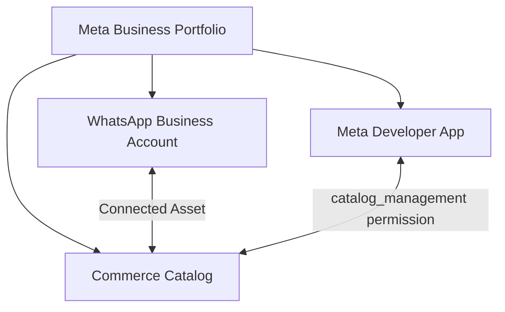

# Meta Onboarding & Onboarding Video Script
## Step-by-Step Guide: Meta Developer App, WhatsApp API, Commerce Catalog, and App Review

This guide outlines the end-to-end steps required to set up a new WhatsApp Business API connection with Meta Catalog integration. You can use this document as a reference script or checklist to record your educational walkthrough videos for your application users.

---

## Overview of the Meta Ecosystem

To send interactive **WhatsApp Product Cards**, four distinct assets must be connected:

---

## Phase 1 — Create a Meta Business Portfolio (Business Manager)

Before starting, the user must have a Meta Business Portfolio.

1. Go to [business.facebook.com/overview](https://business.facebook.com/overview).
2. Click **Create Account**.
3. Enter the Business Name, User Name, and Business Email, and click **Submit**.
4. Verify the email address in the verification email sent by Meta.

---

## Phase 2 — Create a Meta Developer App

This app acts as the API bridge between the CRM database and Meta's servers.

1. Go to the [Meta for Developers Portal](https://developers.facebook.com/apps).
2. Click **Create App** (top right).
3. **Select Use Case:** Select **"Other"** or **"Connect with customers through WhatsApp"**.
   > [!TIP]
   > Selecting the WhatsApp use case pre-configures the app, saving manual configuration steps.
4. Select your **Meta Business Portfolio** in the dropdown to link ownership.
5. Give the app a name (e.g. `[My Business] CRM`) and click **Create App**.

---

## Phase 3 — Set Up the WhatsApp Business Account & Number

1. In the App Dashboard, click **Set Up** on the **WhatsApp** product.
2. Link your Meta Business Portfolio if prompted.
3. **Add Phone Number:**
   - Go to the **API Setup** page in the sidebar.
   - Click **Add Phone Number**.
   - Input your display name, business category, and description.
   - Enter your phone number (must be active and able to receive SMS or Voice calls, and **not** currently registered on a personal WhatsApp mobile app).
   - Enter the verification code received via SMS/voice.

---

## Phase 4 — Generate a Permanent Access Token (System User)

By default, developer console tokens expire in 24 hours. Production CRMs require a permanent **System User Token**.

1. Go to [Meta Business Settings](https://business.facebook.com/settings).
2. Go to **Users** → **System Users** (left sidebar).
3. Click **Add** to create a new system user. Select **Admin System User** as the role.
4. **Assign Assets:**
   - Click on the new System User and click **Assign Assets**.
   - **Apps:** Select your CRM app and toggle **Full Control** (Manage App) to **On**.
   - **WhatsApp Accounts:** Select your account and toggle **Full Control** (Manage WhatsApp Account) to **On**.
   - Click **Save Changes**.
5. **Generate Token:**
   - Click **Generate New Token**.
   - Select your CRM App from the dropdown.
   - Select **Never** for token expiration.
   - Check the following scopes:
     - `whatsapp_business_messaging` ✅
     - `whatsapp_business_management` ✅
     - `catalog_management` ✅ *(Note: If this scope is missing, see Phase 6 below first)*.
   - Click **Generate Token** and copy the token. **Save it securely.**

---

## Phase 5 — Create and Link the Meta Commerce Catalog

To send Product Cards, your inventory must exist in a Meta Catalog.

### Step 1: Create the Catalog
1. Open [Meta Commerce Manager](https://business.facebook.com/commerce).
2. Click **Add Catalog**.
3. Choose **Ecommerce** (suitable for product, real estate, and generic inventories).
4. Select **Upload product info** (do not link a platform like Shopify).
5. Choose your Business Portfolio owner, name the catalog (e.g., `Aryavarta Properties`), and click **Create**.
6. Go to **Settings** (gear icon) and copy the **Catalog ID** (e.g., `1547752690053122`).

### Step 2: Assign System User Access to the Catalog
1. Go to [Meta Business Settings](https://business.facebook.com/settings) → **Data Sources** → **Catalogs**.
2. Select your catalog.
3. Click **Add People**, select your **System User**, toggle **Manage Catalog** to **On**, and click **Save**.

### Step 3: Link Catalog to WhatsApp Account
1. Go to **Accounts** → **WhatsApp Accounts** in Business Settings.
2. Select your account and click the **Settings** tab.
3. Scroll to **Connected Assets** and click **Add Assets**.
4. Select your newly created catalog and save.
   > [!IMPORTANT]
   > This linking step is mandatory. WhatsApp will reject message requests if the catalog is not connected as an asset of the WhatsApp Account.

---

## Phase 6 — App Review & Approval for Catalog Management

To go live for public clients, your Meta App must be approved for `catalog_management`.

### Step 1: Request Permission
1. Go to the [Meta Developer Portal](https://developers.facebook.com/apps) and open your app.
2. Go to **Review** → **Permissions and Features** in the sidebar.
3. Search for `catalog_management` and click **Get Standard Access** / **Request**.

### Step 2: Complete App Settings
1. Go to **App settings** → **Basic** in the sidebar.
2. Enter the following mandatory information:
   - **App Domains:** Your CRM domain (e.g., `aryavartaventures.com`).
   - **Privacy Policy URL:** Link to your privacy policy.
   - **Terms of Service URL:** Link to your terms of service.
   - **User Data Deletion:** Choose "Data deletion instructions URL" and link to your privacy policy page (`#data-deletion`).
   - **Category:** Select "Business" or "Messaging".
   - **App Icon:** Upload a 1024x1024 pixel logo.
3. Click **Save changes**.

### Step 3: Complete Reviewer Instructions
1. Go to **Review** → **App Review** in the sidebar.
2. Click **Next** on the draft submission page.
3. Click **Reviewer instructions** to expand it:
   - **App URL:** Input your CRM URL.
   - **Testing steps:** Copy-paste step-by-step instructions showing where to log in and how to trigger the sync.
   - **Test Credentials:** Provide a test user email and password created in your CRM for the reviewer to log in.
   - **Screen Recording Video:** Record a short walkthrough video (under 2 mins, under 100MB) demonstrating:
     1. Logging in to the CRM.
     2. Opening the inventory page and selecting a listing.
     3. Clicking **Sync to Catalog** and seeing it successfully upload.
     4. Opening the WhatsApp Share Dialog and showing the WhatsApp Product Card integration.
   - Drag and drop this video file into the upload box.
4. Click **Save**.
5. Once all checklist items are green, click the blue **Submit for review** button at the bottom of the dashboard.

---

## Summary Checklist for End-Users

| Phase | Task | Completed? |
|---|---|---|
| **Phase 1** | Meta Business Suite Account created | [ ] |
| **Phase 2** | Developer App configured | [ ] |
| **Phase 3** | WhatsApp Account & Phone Number verified | [ ] |
| **Phase 4** | System User created and permanent token generated | [ ] |
| **Phase 5** | Catalog created, linked to WABA, and assigned to System User | [ ] |
| **Phase 6** | Basic App settings completed and submitted for review | [ ] |
