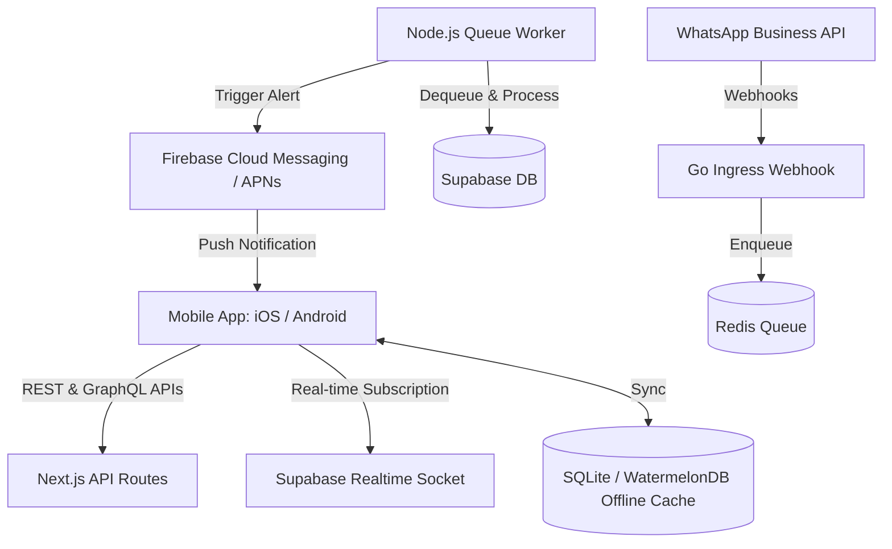
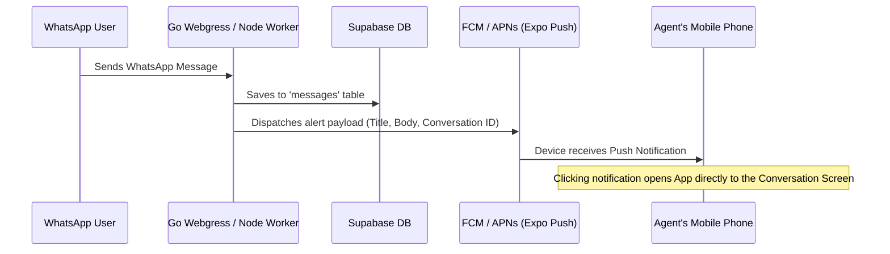

# Companion Mobile App Implementation Plan: iOS & Android

This document outlines the architectural design, technology stack, and phase-by-phase execution plan for building a companion mobile application (iOS & Android) for the **waCRM** platform.

The mobile app will focus on delivering:
1. **Real-time push notifications** for new WhatsApp messages, system alerts, and assigned leads.
2. **In-app chat console** synced in real-time with the web application and WhatsApp.
3. **Offline access** to contacts, lead notes, and messaging drafts.
4. **Native mobile integrations** (direct phone calling, WhatsApp redirection, contacts sharing, and biometric security).

---

## 🏗️ Architecture Overview

The mobile application will connect directly to the existing Supabase backend (PostgreSQL database, Storage Buckets, and Realtime Channels) and push notification servers.



---

## 🛠️ Technology Stack Recommendations

To maximize code reuse, speed up time-to-market, and leverage the existing TypeScript/React ecosystem of waCRM, we recommend a hybrid cross-platform approach:

| Layer | Recommended Choice | Rationale |
| :--- | :--- | :--- |
| **Framework** | **React Native (Expo SDK)** | Reuses existing React components, business logic, types, and hooks. Expo manages build configurations (Android Gradle/iOS Xcode) out of the box. |
| **State Management** | **Zustand + TanStack Query** | High performance, lightweight client-side state caching with automatic caching, background fetching, and query invalidation. |
| **Real-time Sync** | **Supabase Realtime Client** | Native WebSockets support for subscribing to `INSERT` and `UPDATE` events on the `messages`, `contacts`, and `conversations` tables. |
| **Offline DB** | **WatermelonDB** (or SQLite) | High-performance reactive database for React Native. Optimizes querying thousands of local messages/contacts, supporting background sync. |
| **Push Notifications** | **Expo Notifications + FCM/APNs** | Handles credentials, notification certificates, and incoming payloads in foreground/background states. |
| **Authentication** | **Supabase Auth + Native Biometrics** | Secure tokens stored in iOS Keychain/Android Keystore via `expo-secure-store`. Integrates FaceID/TouchID (`expo-local-authentication`). |

---

## 📱 Core Features & Implementation Details

### 1. Inbuilt Real-time Messaging
The messaging interface is the most critical feature. The app must feel as fast and reliable as a native chat application:

* **Real-time Connection**: Subscribe to Supabase Realtime channel changes:
  ```typescript
  const channel = supabase
    .channel('realtime-messages')
    .on('postgres_changes', { event: 'INSERT', schema: 'public', table: 'messages' }, (payload) => {
      // Append to local message state and show inside UI
      updateLocalChatState(payload.new);
    })
    .subscribe();
  ```
* **Offline Queuing**: When sending a message offline, write it to the local store with a status of `pending`. A background task will retry sending pending items to `/api/whatsapp/send` as soon as connectivity returns.
* **Rich Media**: Support for viewing images, playing voice notes (using `expo-av`), and parsing template buttons inside messages.

### 2. Push Notification Pipeline
To deliver instant notifications when a customer sends a message on WhatsApp:



* **Silent Notifications**: Support background syncing of database content when a silent push is received, so the message list is already up to date when the user unlocks their phone.
* **Notification Categories**: Add interactive action buttons directly on the push alert (e.g. "Mark as Read", "Reply: Got it!").

### 3. Native Contact Share & Direct Calling
* **Calling Integration**: Click phone icons to launch native dialers via `expo-linking` (`tel:${phone}`).
* **Share Sheet Extension**: Enable agents to highlight a contact info card or photo on their phone and share it directly into the waCRM app to generate a lead or save an attachment.
* **WhatsApp Deep Link**: Provide a quick shortcut to open the official WhatsApp app targeting a specific contact whenever direct native chats are needed.

---

## 📋 Implementation Phases

### Phase 1: Foundation & Scaffold (Weeks 1-2)
* Scaffold React Native project using **Expo Router** (file-based navigation matching Next.js).
* Install `@supabase/supabase-js` and configure authentication store with secure keychain caching.
* Build authentication screens (Email/OTP login) and enable local Biometric Unlock (FaceID).
* Define unified style system (reusing Tailwind styles with `nativewind` or CSS vars).

### Phase 2: Offline Store & Real-time Chats (Weeks 3-5)
* Configure local schema (SQLite/WatermelonDB) representing `contacts`, `conversations`, and `messages`.
* Implement sync engine: pull pagination records from `/api/properties` and `/api/contacts` on initial launch.
* Build the **Inbox View** and **Chat Console Window** with support for quick template insertions.
* Connect Supabase Realtime sockets to keep chat threads synced live.

### Phase 3: Push Notification Pipeline (Weeks 6-7)
* Setup Apple Developer and Google Firebase projects to configure APNs and FCM certificates.
* Write a database trigger (or add logic in the Node queue worker) to send a POST request to Expo Push Service (`https://exp.host/--/api/v2/push/send`) whenever a new message is inserted with a `direction === 'incoming'` attribute.
* Integrate Expo Notifications listener in the mobile client to handle deep-linking into specific conversation IDs when a notification is clicked.

### Phase 4: Inventory Management & Polish (Weeks 8-9)
* Create the mobile-optimized **Inventory Dashboard**: add/edit property listings (Sale/Rent, Commercial Beds/Baths rules).
* Integrate camera access (`expo-image-picker`) to upload property photos directly from the phone into Supabase storage buckets.
* Test layout responsiveness across multiple iOS and Android screen resolutions.

### Phase 5: Testing & Store Submission (Weeks 10-12)
* Run internal beta distributions using **Expo EAS (Expo Application Services)** and TestFlight (iOS) / Google Play Console Internal Testing (Android).
* Optimize build sizes, fix memory leaks in image rendering lists, and final security audits.
* Submit production builds to App Store and Google Play Store.

## 🎙️ Native Voice Recording & WisprFlow Integration

The mobile application will support native voice note recording and transcriptions via integration with **WisprFlow**:
1. **Direct Audio Capture**: Uses `expo-av` to record voice notes locally from the user's mobile microphone, encoding the audio into standard formats.
2. **WisprFlow AI Transcription**: Dispatches the audio buffer to the WisprFlow REST endpoint to transcribe voice messages into text.
3. **Double Action Trigger**:
   - *Draft Generation*: Transcribed voice prompts feed directly into the AI chatbot engine to automatically create property listings.
   - *Voice Media Messaging*: Send the raw voice recording as a WhatsApp media container directly to the customer's chat console.

---

## 📁 Offline Sync Configuration

To support operation in low-connectivity locations, the companion app utilizes a local **WatermelonDB** architecture backed by SQLite. Real-time updates sync automatically, while modifications made offline are cached locally and batch-uploaded when connectivity is restored.
